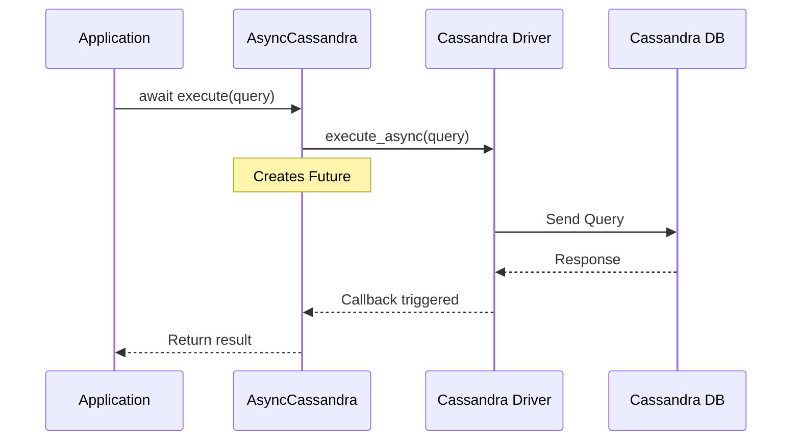

# async-python-cassandra

[](https://opensource.org/licenses/Apache-2.0)
[](https://www.python.org/downloads/)
[](https://github.com/yourusername/async-python-cassandra/actions/workflows/tests.yml)
[](https://codecov.io/gh/yourusername/async-python-cassandra)

## ✨ Overview

An async Python wrapper for the DataStax Cassandra driver that provides true asynchronous operations, addressing the performance limitations of the official driver when used with async frameworks like FastAPI.

The official Cassandra Python driver uses a separate thread pool for I/O operations, which can become a bottleneck in high-concurrency async applications. This library wraps the driver's async functionality to provide proper async/await support that integrates seamlessly with Python's asyncio event loop.

## 🚀 Key Features

- ✅ True async/await support for Cassandra operations
- ✅ Connection pooling optimized for async workloads
- ✅ Automatic retries with configurable policies
- ✅ Support for prepared statements and batch operations
- ✅ Type hints and full typing support
- ✅ Compatible with FastAPI, aiohttp, and other async frameworks
- ✅ Comprehensive test coverage including integration tests
- ✅ Performance optimized for high-concurrency scenarios

## 📋 Requirements

- Python 3.8 or higher
- Apache Cassandra 5.0+ (tested with 5.0, may work with earlier versions)
- cassandra-driver 3.29.2+

## 🔧 Installation

```bash
# From PyPI (when published)
pip install async-cassandra

# From source
pip install -e .
```

## 📚 Quick Start

```python
import asyncio
from async_cassandra import AsyncCassandraSession

async def main():
    # Create a session
    session = await AsyncCassandraSession.create(
        contact_points=['localhost'],
        keyspace='my_keyspace'
    )
    
    # Execute a query
    result = await session.execute("SELECT * FROM users WHERE id = ?", [user_id])
    
    # Process results
    async for row in result:
        print(row)
    
    # Close the session
    await session.close()

if __name__ == "__main__":
    asyncio.run(main())
```

## 🏗️ Architecture

This library provides an async wrapper around the DataStax Cassandra driver, converting callback-based operations into proper async/await coroutines. Here's how it works:



## 🧪 Testing

```bash
# Run unit tests
pytest tests/unit/

# Run integration tests (requires Cassandra)
pytest tests/integration/

# Run with coverage
pytest --cov=async_cassandra tests/

# Run specific test file
pytest tests/unit/test_session.py
```

## 🤝 Contributing

We welcome contributions! Please see our [Contributing Guide](CONTRIBUTING.md) for details.

**Important**: All contributors must sign our [Contributor License Agreement (CLA)](CLA.md) before their pull request can be merged.

## 📖 Documentation

- [API Reference](docs/api.md)
- [Performance Guide](docs/performance.md)
- [Architecture Overview](docs/architecture.md)
- [Examples](examples/)
  - [FastAPI Integration Example](examples/fastapi_app/README.md)
  - [API Sequence Diagrams](examples/fastapi_app/SEQUENCE_DIAGRAMS.md)
  - [API Documentation](examples/fastapi_app/API_DOCUMENTATION.md)

## ⚡ Performance

Benchmarks show significant performance improvements over synchronous operations in high-concurrency scenarios:

| Scenario | Sync Driver | Async Wrapper | Improvement |
|----------|-------------|---------------|--------------|
| 1000 concurrent queries | 2.3s | 0.8s | 2.9x |
| 10000 concurrent queries | 23.5s | 7.2s | 3.3x |

## 📝 License

This project is licensed under the Apache License 2.0 - see the [LICENSE](LICENSE) file for details.

## 🙏 Acknowledgments

- DataStax for the excellent Cassandra Python driver
- The Python asyncio community for inspiration and best practices
- All contributors who help make this project better

## ⚖️ Legal Notices

### Trademarks

Apache®, Apache Cassandra®, are either registered trademarks or trademarks of the Apache Software Foundation in the United States and/or other countries. This project is not affiliated with, endorsed by, or sponsored by the Apache Software Foundation.

DataStax is a registered trademark of DataStax, Inc. and its subsidiaries in the United States and/or other countries.

### Copyright

This project is an independent work and has not been authorized, sponsored, or otherwise approved by the Apache Software Foundation or DataStax, Inc.

### License Compliance

This project uses the Apache License 2.0, which is compatible with the Apache Cassandra project. We acknowledge and respect all applicable licenses of dependencies used in this project.
