# Architecture Overview

This document provides a detailed overview of the async-cassandra library architecture and how it integrates with the DataStax Cassandra driver.

## Table of Contents

- [Problem Statement](#problem-statement)
- [Solution Architecture](#solution-architecture)
- [Component Overview](#component-overview)
- [Execution Flow](#execution-flow)
- [Performance Considerations](#performance-considerations)

## Problem Statement

The DataStax Cassandra Python driver uses a thread pool for I/O operations, which can create bottlenecks in async applications:

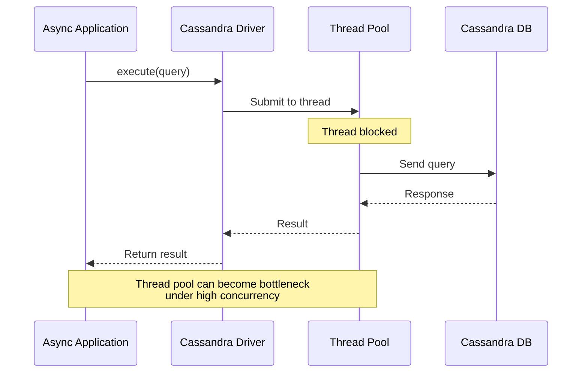

## Solution Architecture

async-cassandra wraps the driver's async operations to provide true async/await support:

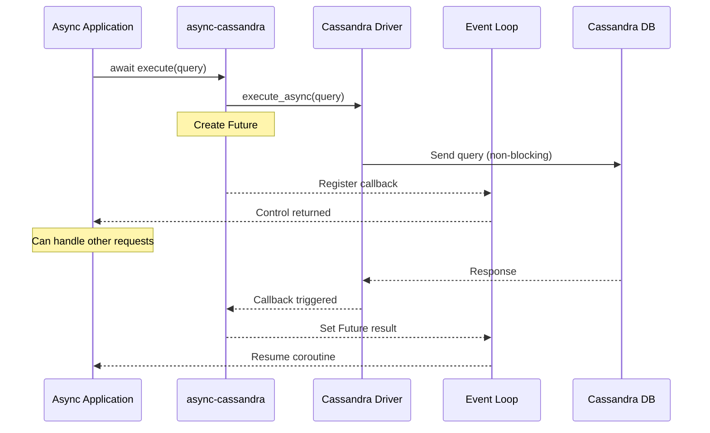

## Component Overview

### 1. AsyncCluster

Manages cluster configuration and lifecycle:

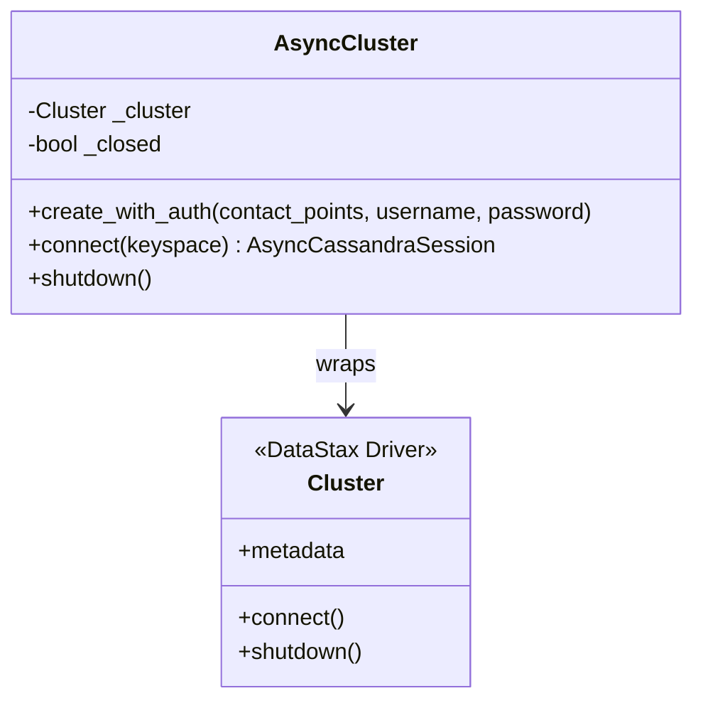

### 2. AsyncCassandraSession

Provides async interface for query execution:

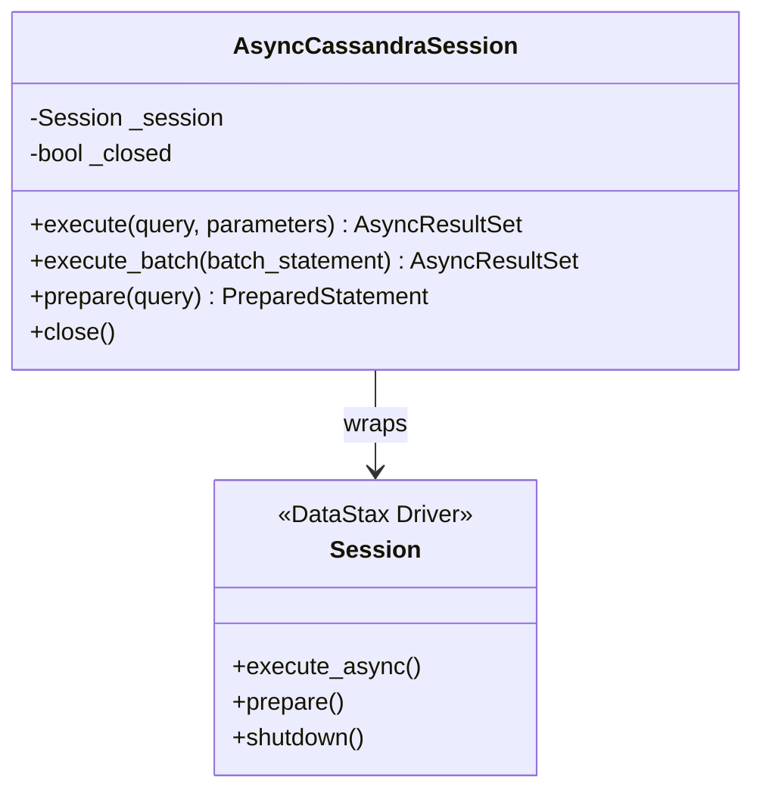

### 3. AsyncResultHandler

Converts callbacks to async/await:

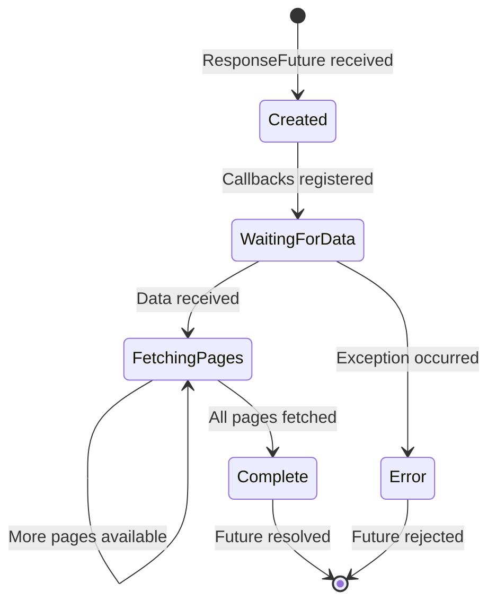

## Execution Flow

### Query Execution

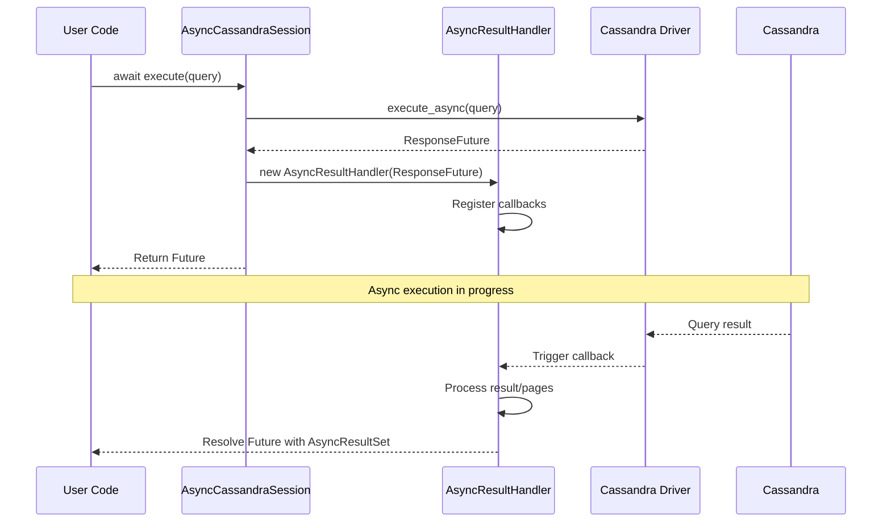

### Batch Operations

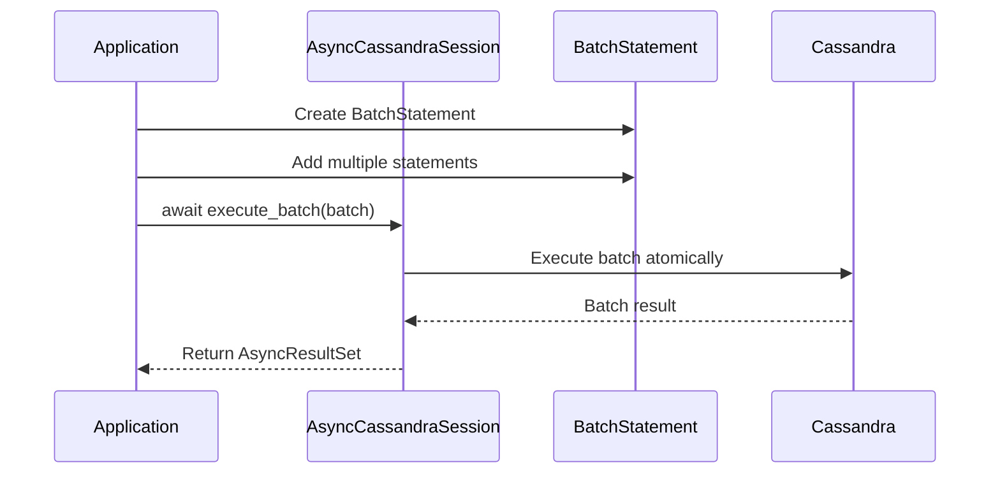

### Connection Pooling

**Important Note**: When using protocol v3+ (Cassandra 2.1+), the Python driver maintains exactly **one TCP connection per host** due to Python's Global Interpreter Lock (GIL). This is different from drivers in other languages (Java, C++) that can maintain multiple connections per host.

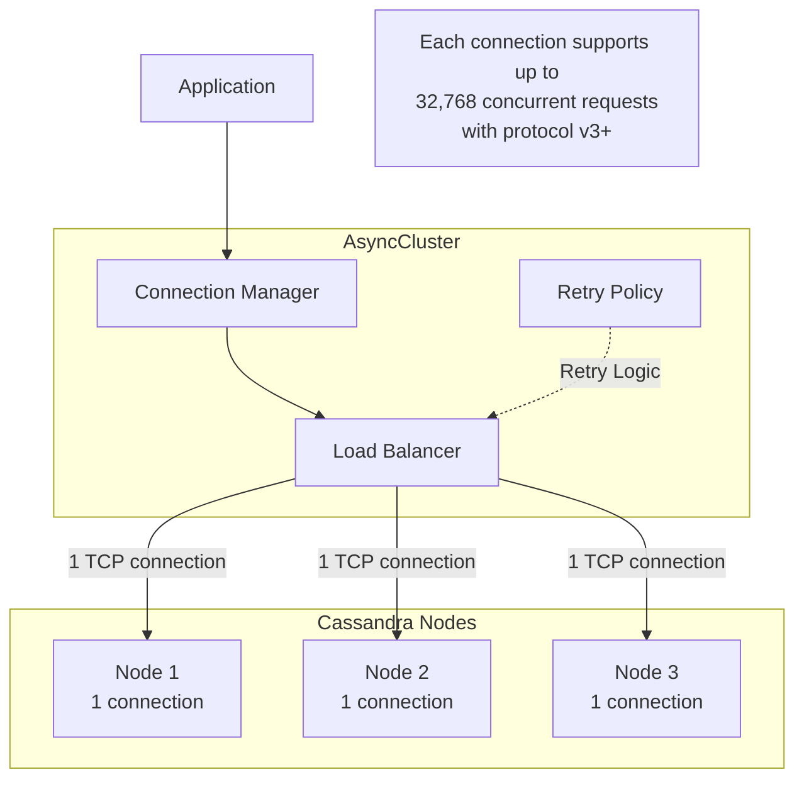

For detailed information about connection pooling behavior and best practices, see our [Connection Pooling Documentation](connection-pooling.md).

## Performance Considerations

### 1. Connection Pool Efficiency

The async wrapper maintains the driver's connection pooling:

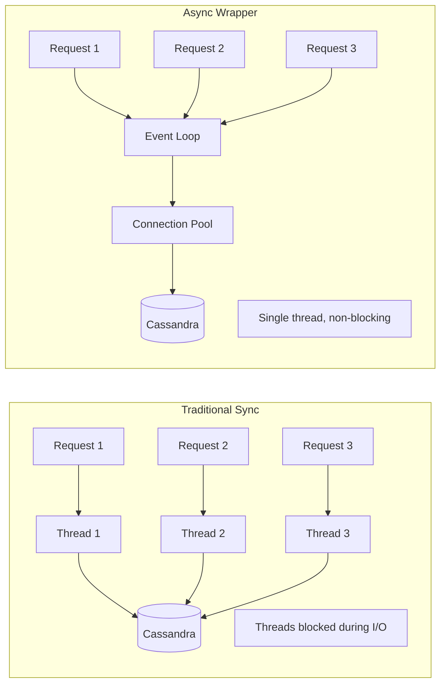

### 2. Concurrency Model

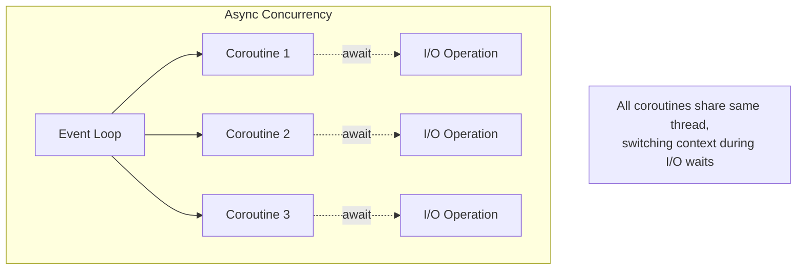

### 3. Resource Usage Comparison

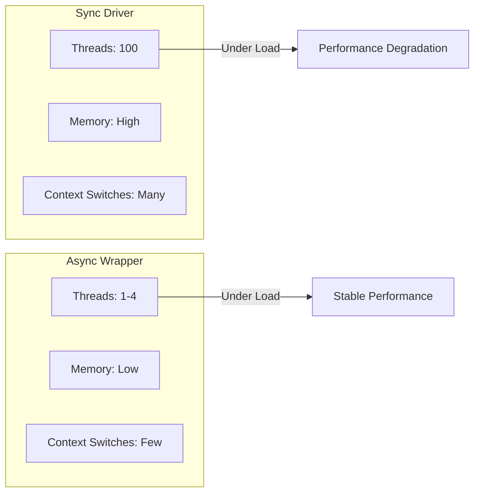

## Best Practices

1. **Connection Management**: Create cluster and session at application startup
2. **Prepared Statements**: Use prepared statements for repeated queries
3. **Batch Operations**: Group related writes for better performance
4. **Error Handling**: Implement proper retry logic for transient failures
5. **Resource Cleanup**: Always close sessions and clusters properly

## Integration with FastAPI

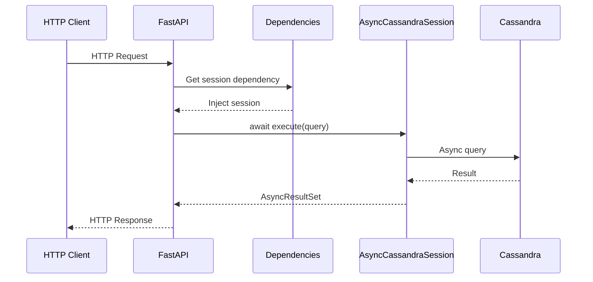

This architecture enables efficient, scalable applications that can handle thousands of concurrent requests without the thread pool bottlenecks of traditional synchronous drivers.