# FastAPI + async-cassandra Sequence Diagrams

This document contains Mermaid sequence diagrams showing the flow of each API endpoint in the FastAPI example application.

## Table of Contents
- [Health Check Endpoint](#health-check-endpoint)
- [Create User Endpoint](#create-user-endpoint)
- [Get User by ID Endpoint](#get-user-by-id-endpoint)
- [List Users Endpoint](#list-users-endpoint)
- [Update User Endpoint](#update-user-endpoint)
- [Delete User Endpoint](#delete-user-endpoint)
- [Async Performance Test Endpoint](#async-performance-test-endpoint)
- [Sync Performance Test Endpoint](#sync-performance-test-endpoint)

## Health Check Endpoint

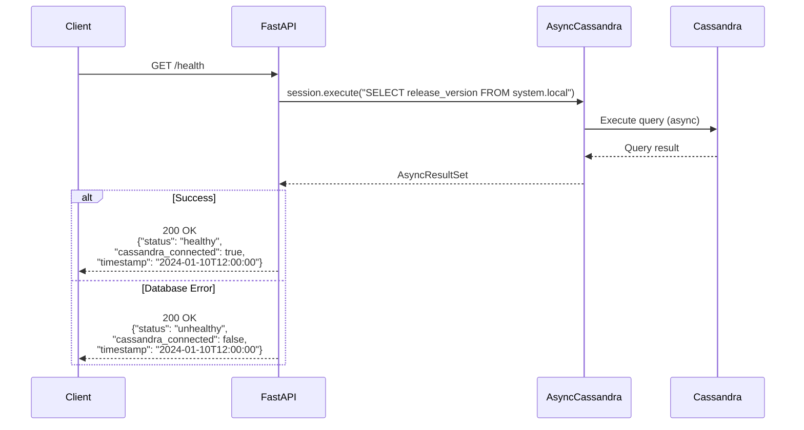

### Example Request:
```bash
curl -X GET http://localhost:8000/health
```

### Example Response:
```json
{
    "status": "healthy",
    "cassandra_connected": true,
    "timestamp": "2024-01-10T12:34:56.789012"
}
```

## Create User Endpoint

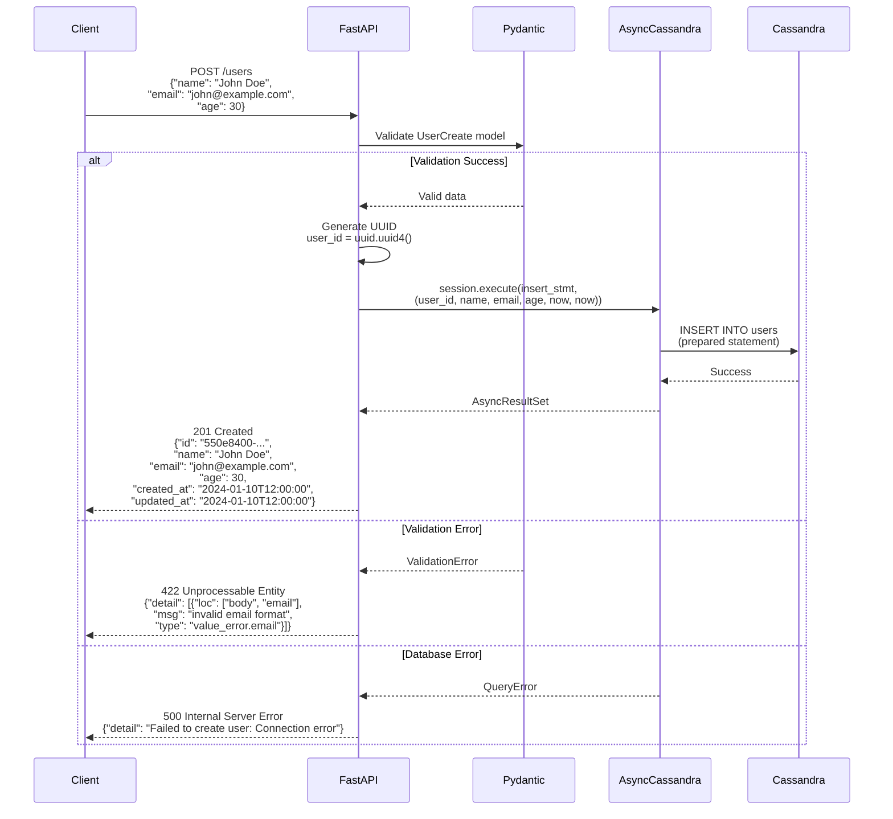

### Example Request:
```bash
curl -X POST http://localhost:8000/users \
  -H "Content-Type: application/json" \
  -d '{
    "name": "John Doe",
    "email": "john@example.com",
    "age": 30
  }'
```

### Example Response:
```json
{
    "id": "550e8400-e29b-41d4-a716-446655440000",
    "name": "John Doe",
    "email": "john@example.com",
    "age": 30,
    "created_at": "2024-01-10T12:34:56.789012",
    "updated_at": "2024-01-10T12:34:56.789012"
}
```

## Get User by ID Endpoint

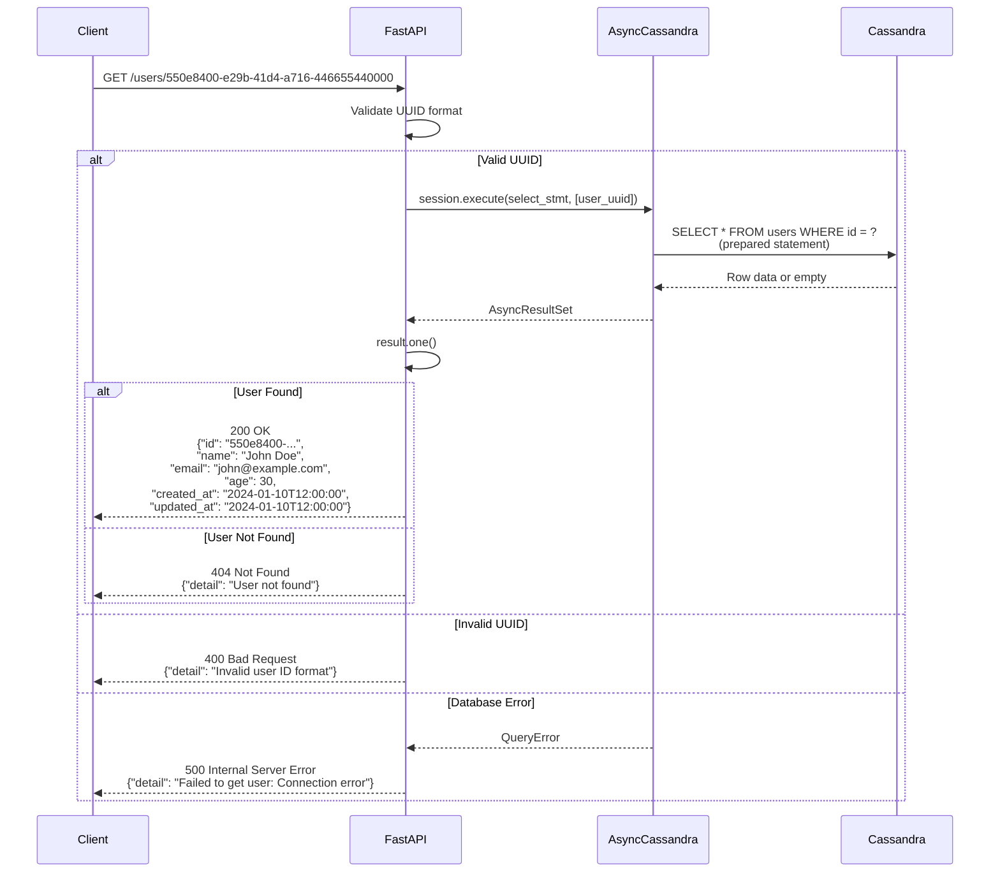

### Example Request:
```bash
curl -X GET http://localhost:8000/users/550e8400-e29b-41d4-a716-446655440000
```

### Example Response:
```json
{
    "id": "550e8400-e29b-41d4-a716-446655440000",
    "name": "John Doe",
    "email": "john@example.com",
    "age": 30,
    "created_at": "2024-01-10T12:34:56.789012",
    "updated_at": "2024-01-10T12:34:56.789012"
}
```

## List Users Endpoint

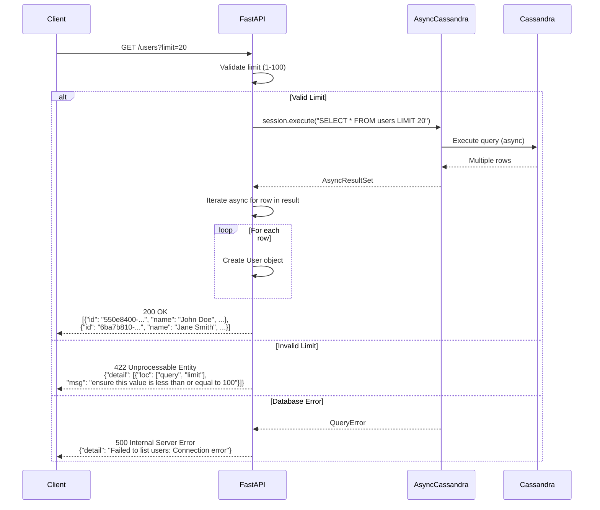

### Example Request:
```bash
curl -X GET "http://localhost:8000/users?limit=10"
```

### Example Response:
```json
[
    {
        "id": "550e8400-e29b-41d4-a716-446655440000",
        "name": "John Doe",
        "email": "john@example.com",
        "age": 30,
        "created_at": "2024-01-10T12:34:56.789012",
        "updated_at": "2024-01-10T12:34:56.789012"
    },
    {
        "id": "6ba7b810-9dad-11d1-80b4-00c04fd430c8",
        "name": "Jane Smith",
        "email": "jane@example.com",
        "age": 25,
        "created_at": "2024-01-10T13:00:00.000000",
        "updated_at": "2024-01-10T13:00:00.000000"
    }
]
```

## Update User Endpoint

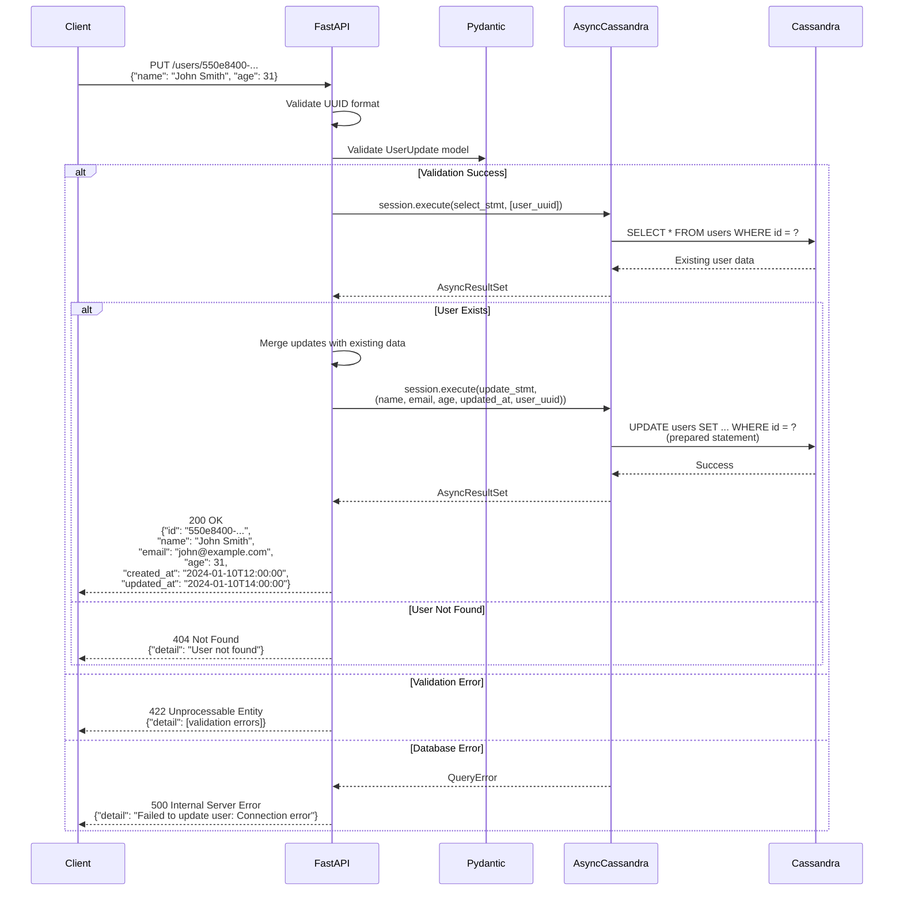

### Example Request:
```bash
curl -X PUT http://localhost:8000/users/550e8400-e29b-41d4-a716-446655440000 \
  -H "Content-Type: application/json" \
  -d '{
    "name": "John Smith",
    "age": 31
  }'
```

### Example Response:
```json
{
    "id": "550e8400-e29b-41d4-a716-446655440000",
    "name": "John Smith",
    "email": "john@example.com",
    "age": 31,
    "created_at": "2024-01-10T12:34:56.789012",
    "updated_at": "2024-01-10T14:00:00.123456"
}
```

## Delete User Endpoint

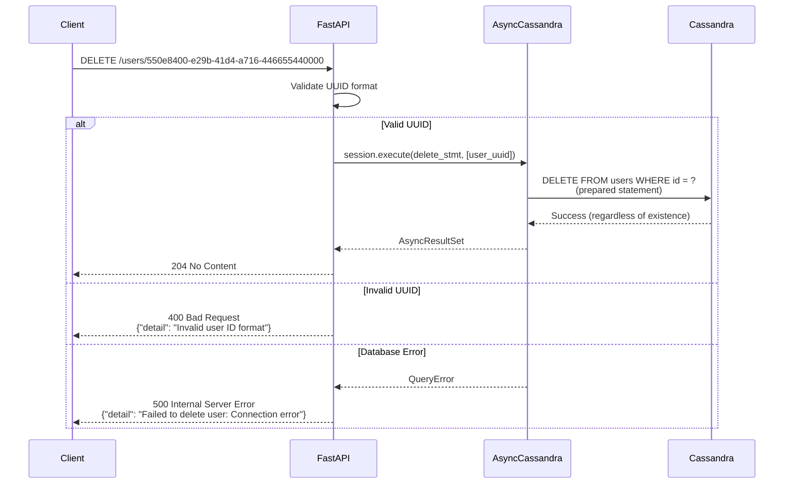

### Example Request:
```bash
curl -X DELETE http://localhost:8000/users/550e8400-e29b-41d4-a716-446655440000
```

### Example Response:
```
HTTP/1.1 204 No Content
```

## Async Performance Test Endpoint

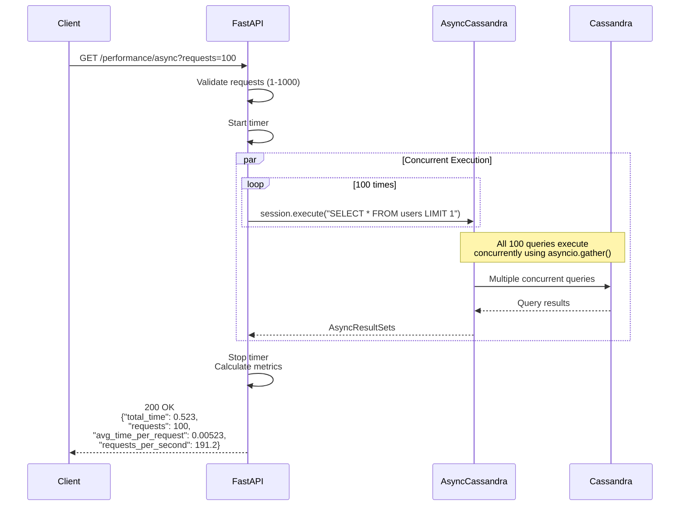

### Example Request:
```bash
curl -X GET "http://localhost:8000/performance/async?requests=500"
```

### Example Response:
```json
{
    "total_time": 2.615,
    "requests": 500,
    "avg_time_per_request": 0.00523,
    "requests_per_second": 191.2
}
```

## Sync Performance Test Endpoint

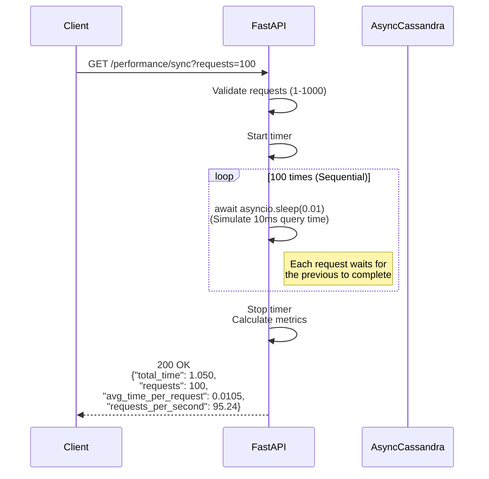

### Example Request:
```bash
curl -X GET "http://localhost:8000/performance/sync?requests=100"
```

### Example Response:
```json
{
    "total_time": 1.050,
    "requests": 100,
    "avg_time_per_request": 0.0105,
    "requests_per_second": 95.24
}
```

## Application Lifecycle

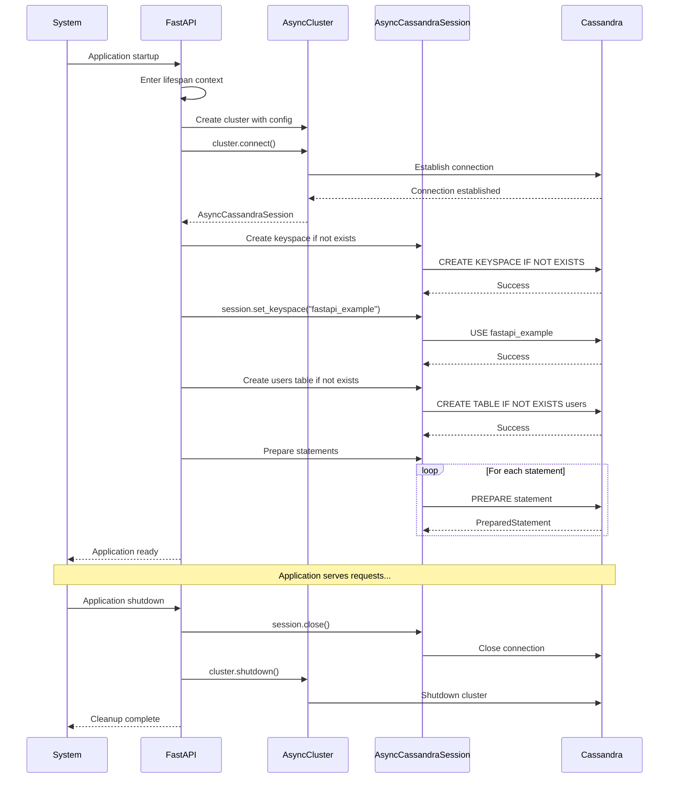

## Error Handling Flow

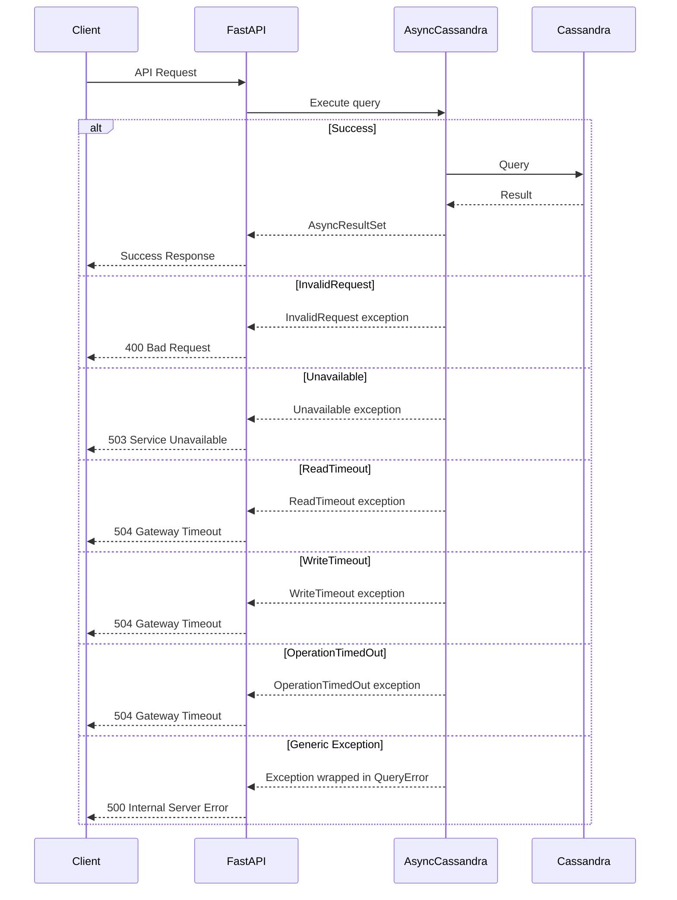

## Performance Comparison

The key difference between async and sync operations:

```mermaid
gantt
    title Query Execution Timeline
    dateFormat X
    axisFormat %L
    
    section Async (100 queries)
    Query 1     :a1, 0, 10
    Query 2     :a2, 0, 10
    Query 3     :a3, 0, 10
    ...         :a4, 0, 10
    Query 100   :a100, 0, 10
    Total Time  :milestone, 10, 0
    
    section Sync (100 queries)
    Query 1     :s1, 0, 10
    Query 2     :s2, 10, 10
    Query 3     :s3, 20, 10
    ...         :s4, 30, 10
    Query 100   :s100, 990, 10
    Total Time  :milestone, 1000, 0
```

In the async model, all 100 queries execute concurrently, completing in approximately the time of a single query. In the sync model, each query must wait for the previous one to complete, resulting in 100x the execution time.